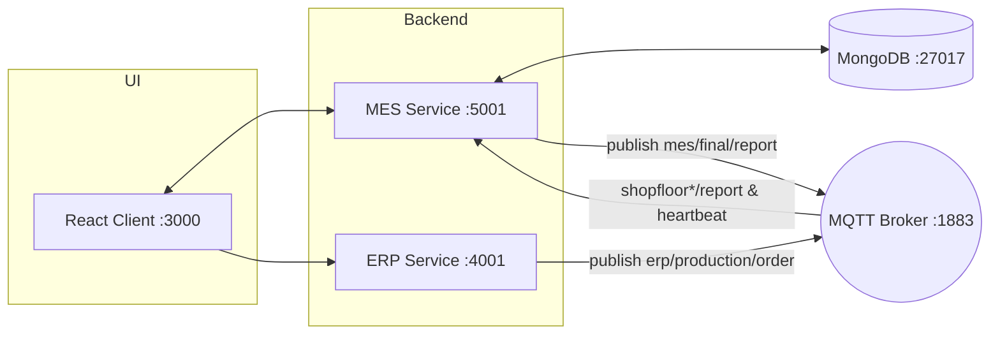

# MES System – Project Overview and Setup

This project is a simplified ISA-95 style Manufacturing Execution System (MES) demo with:
- ERP service that accepts production orders and publishes them to MQTT.
- MES service that listens to shopfloor reports, aggregates results, manages workloads/capacities, and exposes REST APIs with authentication (incl. Google OAuth).
- React frontend client that interacts with the MES/ERP services.

The solution is designed to run locally using MongoDB and an MQTT broker (e.g., Mosquitto).

## Directory Structure

```
MES system - Track2/
  project1/
    client/              # React app (Create React App)
    server/
      config/            # Central config (MQTT topics, DB names)
      db/                # MongoDB connection helpers
      mes/               # MES service (REST APIs, MQTT handlers, auth)
      erp.js             # ERP HTTP service (publishes orders via MQTT)
      config.js          # Re-exports ./config/index.js
```

Key files to know:
- `project1/client/package.json`: CRA scripts for the frontend.
- `project1/server/config/index.js`: MQTT topics, DB names, and JWT secret.
- `project1/server/mes/mes.js`: MES server entry. REST endpoints + MQTT message handling.
- `project1/server/erp.js`: ERP server entry. Accepts orders and publishes to MQTT.
- `project1/server/db/mongo.js`: MongoDB connections for MES/ERP and shopfloor DBs.

## Architecture



## Prerequisites

- Node.js LTS (18+ recommended)
- npm
- MongoDB running locally on `mongodb://localhost:27017`
- MQTT broker on `mqtt://localhost:1883` (e.g., [Eclipse Mosquitto](https://mosquitto.org/))

## Configuration

Central config is in `project1/server/config/index.js`:
- `mqttBrokerUrl`: default `mqtt://localhost:1883`
- `mongoUrl`: default `mongodb://localhost:27017`
- Database names for MES/ERP and shopfloors
- `jwtSecret`: reads `process.env.JWT_SECRET` or falls back to a default

Environment variables are read by MES (and Google OAuth routes) from `project1/server/.env` if present. Recommended keys:

```
# project1/server/.env
JWT_SECRET=change-me
SESSION_SECRET=change-me-too
FRONTEND_URL=http://localhost:3000
CALLBACK_URL=http://localhost:5001/auth/google/callback
GOOGLE_CLIENT_ID=your-google-oauth-client-id
GOOGLE_CLIENT_SECRET=your-google-oauth-client-secret
```

Adjust `config/index.js` or these variables as needed for your environment.

## Install & Run

### 1) Start infrastructure
- Start MongoDB (listening on `localhost:27017`).
- Start an MQTT broker (listening on `localhost:1883`).

### 2) Backend services (ERP and MES)

There is no `package.json` in `project1/server/` yet. Initialize once and install dependencies:

```
# From project1/server/
npm init -y
npm install express body-parser mqtt cors mongodb dotenv jsonwebtoken passport passport-google-oauth20 express-session
```

Run ERP service (HTTP on :4001):
```
# From project1/server/
node erp.js
```

Run MES service (HTTP on :5001):
```
# From project1/server/
node mes/mes.js
```

Notes:
- On first run, `mes.js` seeds default shopfloor capacities in the MES DB if missing.
- MES subscribes to `erp/production/order`, `shopfloor*/report`, and `mes/shopfloors/heartbeat` topics.

### 3) Frontend client

```
# From project1/client/
npm install
npm start
```

The UI runs on `http://localhost:3000`.

## How It Works (High-Level)

- ERP receives a production order via `POST /api/send-order` and publishes it to MQTT topic `erp/production/order`.
- Shopfloors (external or simulated) publish production reports to topics in `config/index.js` (e.g., `shopfloor1/report`).
- MES subscribes to these topics, stores per-shopfloor reports, tracks workloads, aggregates when all required reports for an order arrive, then publishes a final combined report to `mes/final/report` and stores it in MongoDB.
- MES exposes REST APIs to fetch statuses, reports, capacities, workloads, and supports manual load distribution.
- Authentication is supported via username/password JWT and optional Google OAuth (redirects back to the frontend with a token).

## Important Endpoints (MES: :5001)

- Public auth:
  - `POST /api/register`
  - `POST /api/login`
  - `GET /auth/google`
  - `GET /auth/google/callback` (uses `CALLBACK_URL`)

- Protected (require JWT in `Authorization: Bearer <token>`):
  - `GET /api/status` – heartbeat-based status per shopfloor
  - `GET /api/capacities` | `POST /api/capacities`
  - `GET /api/workloads` | `POST /api/workloads/reset`
  - `GET /api/reports` – combined summaries
  - `GET /api/reports/mes` – MES combined reports (scoped by user unless admin)
  - `GET /api/reports/shopfloors` – raw shopfloor reports (scoped by user unless admin)
  - `GET /api/reports/erp` – ERP orders (scoped by user unless admin)
  - `POST /api/reports/:id/comment` – comment on a combined MES report
  - `POST /api/reports/shopfloors/:id/comment` – comment on a specific shopfloor report
  - `GET /api/comments/shopfloors` – query per-report comments (optional `?shopfloor=`)
  - `POST /api/comments/shopfloors/order` – comment for a shopfloor tied to an order
  - `POST /api/distribute-load` – publish manual distribution to shopfloors (validates capacities/workloads)

- ERP service (:4001):
  - `POST /api/send-order` – accepts order payload and publishes to MQTT

## MQTT Topics

From `project1/server/config/index.js`:
- Orders (ERP → MES): `erp/production/order`
- Heartbeats (Shopfloors → MES): `mes/shopfloors/heartbeat`
- Shopfloor reports (Shopfloors → MES):
  - `shopfloor1/report`
  - `shopfloor2/report`
  - `shopfloor3/report`
- Final combined report (MES → subscribers): `mes/final/report`
- Instructions (MES → shopfloors):
  - `mes/shopfloor1/instruction`
  - `mes/shopfloor2/instruction`
  - `mes/shopfloor3/instruction`

## Simulating Shopfloors

You can simulate shopfloor reports by publishing JSON messages to the report topics. Example payload:
```json
{
  "OrderID": "PS-001",
  "Produced": 1000,
  "Defective": 10,
  "Equipment": "SHOPFLOOR1"
}
```
When all three shopfloors report for the same `OrderID`, MES aggregates and stores/publishes a combined report.

## Troubleshooting

- Ensure MongoDB and MQTT are running and reachable at the URLs defined in `config/index.js`.
- If Google OAuth fails, confirm `GOOGLE_CLIENT_ID/SECRET`, `CALLBACK_URL`, and authorized redirect URIs in the Google Cloud Console.
- CORS issues: both ERP and MES enable CORS; verify ports and `FRONTEND_URL`.
- JWT token: the client should pass it as `Authorization: Bearer <token>` for protected MES endpoints.

## Next Steps

- Create a `project1/server/package.json` with npm scripts to start ERP and MES.
- Add Dockerfiles and/or docker-compose to spin up MongoDB, MQTT, ERP, MES, and the client together.
- Add automated tests for MES APIs.
